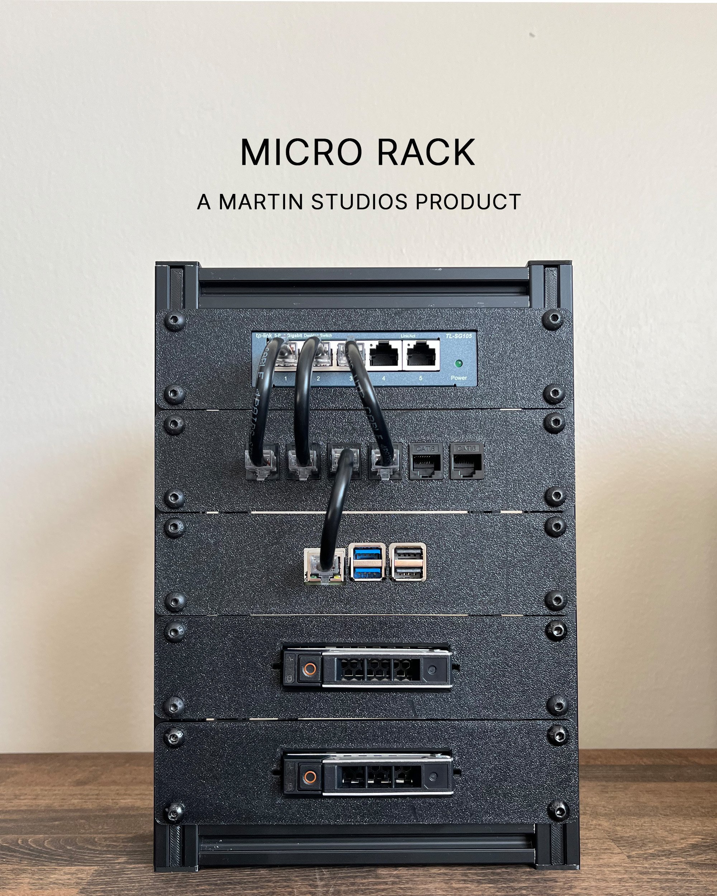

# The Micro Rack - A Premium Desktop Networking Rack

Build a compact **Micro Homelab Rack** designed for small-form-factor servers, networking equipment, Raspberry Pi projects, and other compact hardware.

The rack is built around **2020 aluminum extrusion** and provides a simple, modular way to organize your homelab without needing a full-size server rack, while still relying on **standard 1U spacing**.

Use it however you want — build a small network setup, NAS, server, media system, router setup, or your own custom project!

---

## 🛒 Don't Want to Build It Yourself?

The complete **Micro Rack** is available through my Etsy shop.

The kit includes a **fully assembled rack**, mounting hardware, and **two generic mounting trays** — giving you everything you need to get started without sourcing and fabricating the individual components yourself.

**[🛍️ Purchase the Micro Rack on Etsy](https://www.etsy.com/listing/4559708812/the-micro-rack-a-mini-desktop-networking)**

---

## 🚀 Build Your Own

### 📐 Specifications

- **Total Dimensions:** 263 × 190 × 186 mm (H × D × W)
- **Available Internal Device/Tray Width:** 146 mm
- **Rack Height:** 5U
- **Rack Spacing:** Standard 1U spacing

### 🔧 What You'll Need

The Micro Rack can be built using commonly available hardware and 2020 aluminum extrusion.

At a minimum, you'll need:

- 2020 aluminum extrusion
- T-nuts
- Corner brackets
- M5 × 10 mm button-head screws for tray mounting points
- 3D printed T-nut spacers/inserts

The 3D printed spacers used by the Micro Rack are available in my **[10-Inch Homelab Rack project](https://github.com/MartinStudiosDev/Parametric-10In-Homelab-Rack)** and can be printed using the files provided there.

### 🖨️ Custom Trays

Looking for different mounting options? I've also designed a variety of **3D printable trays** specifically for the Micro Rack.

Check out my **[MakerWorld profile](https://makerworld.com/en/@Rmartin3D/upload)** for available trays and other printable accessories.

The tray models include **STEP files**, making them easy to modify in free CAD software such as **Fusion 360** or **FreeCAD**.

More tray designs will be added over time!

> **💡 Looking for a standard 10-inch rack?**
>
> The linked project above is a great alternative for a larger, standard 10-inch rack.

### 📏 Extrusion Cut List

| Quantity | Length |
|:-------:|-------:|
| 4 | 263 mm |
| 4 | 190 mm |
| 4 | 186 mm |

---

## ❤️ Support the Project

If you build your own Micro Rack, I'd love to see it!

Consider sharing photos of your build, starring this repository, or checking out my other projects.

Stay up to date with my projects via **TikTok** found below.

---

## 🔗 My Links

- ☕ [Support Me!](https://buymeacoffee.com/rmartin3d)
- 🎵 [TikTok](https://www.tiktok.com/@rmartin3d)
- ▶️ [YouTube](https://www.youtube.com/@Rmartin3D)
- 🛒 [Etsy](https://rmartin3d.etsy.com)

---

**Happy building!** 🔧
